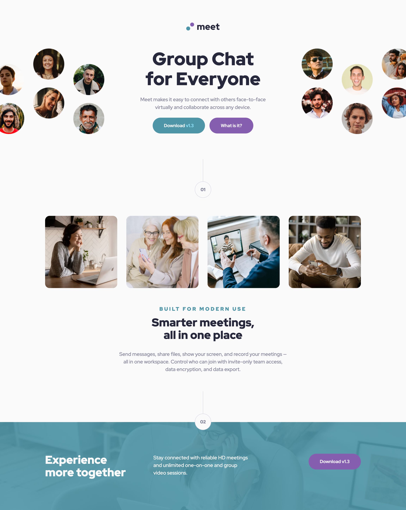

# Frontend Mentor - Meet landing page solution

This is a solution to the [Meet landing page challenge on Frontend Mentor](https://www.frontendmentor.io/challenges/meet-landing-page-rbTDS6OUR). Frontend Mentor challenges help you improve your coding skills by building realistic projects.

## Table of contents

- [Overview](#overview)
  - [The challenge](#the-challenge)
  - [Screenshot](#screenshot)
  - [Links](#links)
- [My process](#my-process)
  - [Built with](#built-with)
  - [What I learned](#what-i-learned)
  - [Continued development](#continued-development)
  - [Useful resources](#useful-resources)
- [Author](#author)
- [Acknowledgments](#acknowledgments)

## Overview

### The challenge

Users should be able to:

- View the optimal layout depending on their device's screen size
- See hover states for interactive elements

### Screenshot

### Links

- Solution URL: [github.com/jyeharry/meet-landing-page](https://github.com/jyeharry/meet-landing-page)
- Live Site URL: [jyeharry.github.io/meet-landing-page/](https://jyeharry.github.io/meet-landing-page/)

## My process

### Built with

- Semantic HTML5 markup
- CSS custom properties
- Flexbox
- Mobile-first workflow

### What I learned

Made greater use of layouts from [Every Layout](https://every-layout.dev/).

### Useful resources

- [Every Layout](https://every-layout.dev/). - This has helped heaps with creating reusable layout classes.

## Author

- Website - [jyeharry.github.io/](https://jyeharry.github.io/)
- Frontend Mentor - [@jyeharry](https://www.frontendmentor.io/profile/jyeharry)
